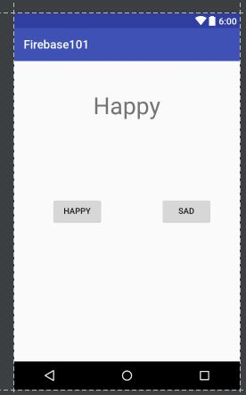
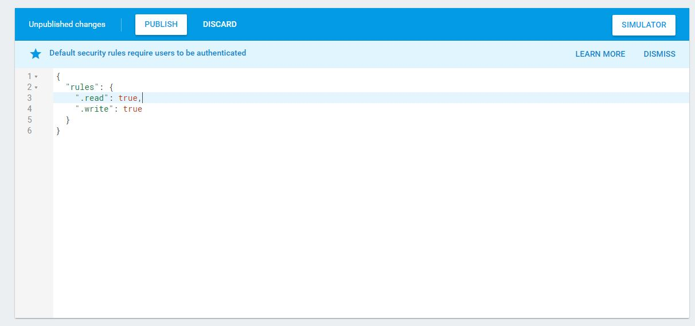

#### Firebase documentation: https://firebase.google.com/docs/

Firebase is integrated into Android Studio after 2.1.+ version. In this lab, I am using Android Studio 2.2.1. I would recommend to update Android Studio to this version.

Create a new project in Android studio.

- Add in the main layout with 1 TextView and 2 Button
(either use drag and drop design or text editor)



```xml
<?xml version="1.0" encoding="utf-8"?>
<RelativeLayout xmlns:android="http://schemas.android.com/apk/res/android"
  xmlns:tools="http://schemas.android.com/tools"
  android:id="@+id/activity_main"
  android:layout_width="match_parent"
  android:layout_height="match_parent"
  android:paddingBottom="@dimen/activity_vertical_margin"
  android:paddingLeft="@dimen/activity_horizontal_margin"
  android:paddingRight="@dimen/activity_horizontal_margin"
  android:paddingTop="@dimen/activity_vertical_margin"
  tools:context="com.tinkersstudio.firebase101.MainActivity">

  <TextView
      android:layout_width="wrap_content"
      android:layout_height="wrap_content"
      android:layout_alignParentTop="true"
      android:layout_centerHorizontal="true"
      android:layout_marginTop="37dp"
      android:textSize="40dp"
      android:id="@+id/textView2"
      android:text="Happy" />

  <Button
      android:text="Sad"
      android:layout_width="wrap_content"
      android:layout_height="wrap_content"
      android:layout_alignTop="@+id/button"
      android:layout_toEndOf="@+id/textView2"
      android:id="@+id/button_sad" />

  <Button
      android:text="Happy"
      android:layout_width="wrap_content"
      android:layout_height="wrap_content"
      android:id="@+id/button"
      android:layout_centerVertical="true"
      android:layout_alignParentStart="true"
      android:layout_marginStart="47dp" />
</RelativeLayout>
```

**** If you use Android Studio version 2.1.0 and up, you can skip edit gradle files

In gradle file, add the dependency
```code
dependencies {
    compile fileTree(dir: 'libs', include: ['*.jar'])
    androidTestCompile('com.android.support.test.espresso:espresso-core:2.2.2', {
        exclude group: 'com.android.support', module: 'support-annotations'
    })
    compile 'com.android.support:appcompat-v7:24.2.1'
    compile 'com.google.firebase:firebase-database:9.8.0'
    testCompile 'junit:junit:4.12'
}


apply plugin: 'com.google.gms.google-services'
```

In the other gradle file, edit the file and add the google service dependency

```code
buildscript {
    repositories {
        jcenter()
    }
    dependencies {
        classpath 'com.android.tools.build:gradle:2.2.1'

        // NOTE: Do not place your application dependencies here; they belong
        // in the individual module build.gradle files
        classpath 'com.google.gms:google-services:3.0.0'
    }
}

allprojects {
    repositories {
        jcenter()
    }
}

task clean(type: Delete) {
    delete rootProject.buildDir
}
```

We are all set for the basic setup, the last step is adding the permission for your database access


Link the UI component in the layout
```java
public class MainActivity extends AppCompatActivity {

    TextView condition;
    Button buttonHappy;
    Button buttonSad;

    @Override
    protected void onCreate(Bundle savedInstanceState) {
        super.onCreate(savedInstanceState);
        setContentView(R.layout.activity_main);

        condition = (TextView) findViewById(R.id.textView2);
        buttonHappy = (Button) findViewById(R.id.button_happy);
        buttonSad = (Button) findViewById(R.id.button_sad);

        buttonHappy.setOnClickListener(new View.OnClickListener() {
            @Override
            public void onClick(View view) {
                //Implement listener
            }
        });

        buttonSad.setOnClickListener(new View.OnClickListener() {
            @Override
            public void onClick(View view) {
                // Implement the listener
            }
        });
    }
}
```

Add the reference to the database
```java

//connect to the database with the reference to the database
FirebaseDatabase database = FirebaseDatabase.getInstance();
DatabaseReference conditionRef = database.getReference("condition");
```
Add the reference whenever the data change
```java
conditionRef.addValueEventListener(new ValueEventListener() {
    @Override
    public void onDataChange(DataSnapshot dataSnapshot) {
        String text = dataSnapshot.getValue(String.class);
        condition.setText(text);
    }

    @Override
    public void onCancelled(DatabaseError databaseError) {

    }
});

The complete code for the project

```java
package com.tinkersstudio.firebase101;

import android.support.v7.app.AppCompatActivity;
import android.os.Bundle;
import android.view.View;
import android.widget.Button;
import android.widget.TextView;

import com.google.firebase.database.ChildEventListener;
import com.google.firebase.database.DataSnapshot;
import com.google.firebase.database.DatabaseError;
import com.google.firebase.database.DatabaseReference;
import com.google.firebase.database.FirebaseDatabase;
import com.google.firebase.database.ValueEventListener;

public class MainActivity extends AppCompatActivity {

    TextView condition;
    Button buttonHappy;
    Button buttonSad;

    //connect to the database with the reference to the database
    FirebaseDatabase database = FirebaseDatabase.getInstance();
    DatabaseReference conditionRef = database.getReference("condition");


    @Override
    protected void onCreate(Bundle savedInstanceState) {
        super.onCreate(savedInstanceState);
        setContentView(R.layout.activity_main);

        condition = (TextView) findViewById(R.id.textView2);
        buttonHappy = (Button) findViewById(R.id.button_happy);
        buttonSad = (Button) findViewById(R.id.button_sad);

        conditionRef.addValueEventListener(new ValueEventListener() {
            @Override
            public void onDataChange(DataSnapshot dataSnapshot) {
                String text = dataSnapshot.getValue(String.class);
                condition.setText(text);
            }

            @Override
            public void onCancelled(DatabaseError databaseError) {

            }
        });


        buttonHappy.setOnClickListener(new View.OnClickListener() {
            @Override
            public void onClick(View view) {
                conditionRef.setValue("Happy");
            }
        });

        buttonSad.setOnClickListener(new View.OnClickListener() {
            @Override
            public void onClick(View view) {
                conditionRef.setValue("Sad");
            }
        });
    }

}
```
